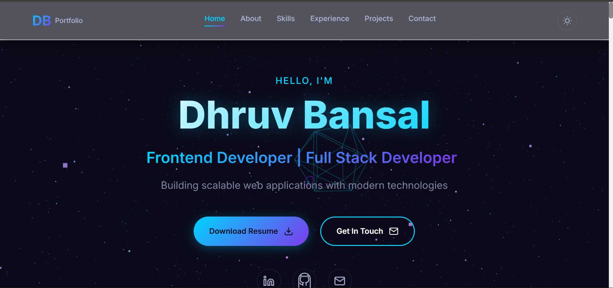

# 🚀 Dhruv Bansal - Developer Portfolio

A modern, responsive portfolio website showcasing my projects, skills, and experience as a Full Stack Developer.



## 👨‍💻 About Me

I'm Dhruv Bansal, a Computer Science student specializing in Full Stack Development with expertise in React, Node.js, and modern web technologies. I'm passionate about building scalable web applications and solving real-world problems through code.

- 🎓 B.Tech in Computer Science - KIET Group of Institutions (82.20% CGPA)
- 💼 3 Internships Completed (Codec Technologies, Proxenix, Bharat Intern)
- 🏆 AWS Certified Developer & AI Practitioner
- 📄 Published Research Paper at IMPACT-2026 Conference

## 🌐 Live Website

Visit my portfolio: **[Add your deployed URL here]**

## 🛠️ Tech Stack

### Frontend
- **Angular 17+** - Modern web framework with standalone components
- **TypeScript** - Type-safe JavaScript
- **SCSS** - Advanced styling
- **RxJS** - Reactive programming
- **EmailJS** - Contact form integration

### Tools & Technologies
- **Git & GitHub** - Version control
- **Vercel/Netlify** - Deployment platforms
- **Responsive Design** - Mobile-first approach
- **SEO Optimized** - Search engine friendly

## ✨ Features

- 🎨 Modern glass-morphic UI design
- 🌓 Dark/Light theme toggle
- 📱 Fully responsive (mobile, tablet, desktop)
- ✉️ Working contact form with EmailJS
- 🎯 Interactive project showcase
- 📊 Skills visualization with proficiency levels
- 💼 Experience timeline with certificates
- 🚀 Smooth animations and transitions
- ⚡ Fast loading and optimized performance

## 📂 Projects

My portfolio showcases 6+ projects including:
- AI-Powered Recruitment Platform
- Agro Connect - Farmer Marketplace
- Real-Time Chat Application
- ERP Hub - Enterprise Resource Planning System
- LearnHub India - Online Learning Platform
- Online Food Ordering System

**Visit my portfolio website to explore all projects in detail!**

## 📫 Contact

- **Email:** dhruvbansal2411@gmail.com
- **Phone:** +91-9389762249
- **GitHub:** [@dhruvbansal2411](https://github.com/dhruvbansal2411)
- **LinkedIn:** [Dhruv Bansal](https://www.linkedin.com/in/dhruv-bansal-9045b7262/)
- **Location:** Delhi NCR, India

## 🚀 Quick Start (For Developers)

If you want to run this portfolio locally:

```bash
# Clone the repository
git clone https://github.com/dhruvbansal2411/portfolio.git
cd portfolio/portfolio-fronted

# Install dependencies
npm install

# Run development server
npm start

# Build for production
npm run build
```

The application will be available at `http://localhost:4200`

## 📝 License

This project is licensed under the MIT License - see the [LICENSE](LICENSE) file for details.

---

**Made with ❤️ using Angular 17+**

*Feel free to reach out if you'd like to collaborate on a project or just want to connect!*
